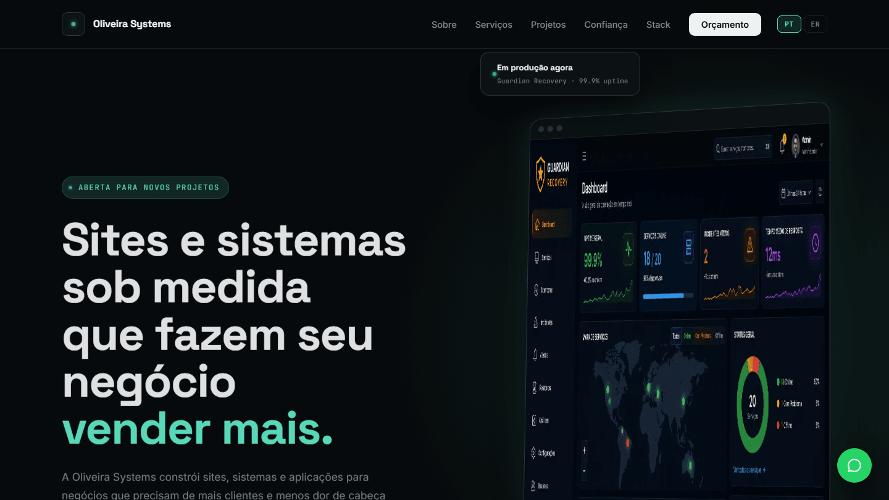

# Oliveira Systems

Site institucional e máquina de geração de leads da **Oliveira Systems** — engenharia full-stack liderada por [Roberson de Oliveira](https://github.com/RobersonCodes). Site estático (sem build step), bilíngue (PT-BR/EN), com formulário de orçamento, prova social e SEO técnico completo.



---

## Sobre

O projeto reúne dois papéis num único repositório:

1. **Site institucional** (`index.html`) — hero, prova social, serviços, FAQ, formulário de orçamento e lead magnet, pensado pra converter visitante em contato em menos de 60 segundos.
2. **Portfólio técnico** (`/projetos`) — 12 estudos de caso reais, cada um com problema, solução, stack, funcionalidades e resultado.

Todo o site é HTML/CSS/JS puro — sem framework, sem bundler, sem dependência de build. O i18n (PT/EN) é feito por um dicionário JS simples (`main.js` + `*.translations.js` por página) que troca `innerHTML` via `data-i18n`.

## Funcionalidades

- **Formulário de orçamento e lead magnet** conectados via [Formspree](https://formspree.io), com consentimento LGPD e indicadores de confiança
- **WhatsApp inteligente** — botão flutuante com menu de mensagens pré-preenchidas por assunto (Orçamento, Web, Sistemas, SaaS, APIs, IA)
- **Prova social honesta** — métricas verificáveis e um selo "cliente real" reservado só a projetos com cliente pagante de fato
- **FAQ e processo de contratação** explicados, com `schema.org/FAQPage`
- **SEO técnico** — `sitemap.xml`, `robots.txt`, canonical, Open Graph e `schema.org/BreadcrumbList` por página de projeto, `schema.org/ProfessionalService` com catálogo de serviços
- **Acessibilidade** — skip-link, contraste WCAG AA, `aria-*` em componentes interativos, respeita `prefers-reduced-motion`
- **Política de Privacidade** (`privacidade.html`) cobrindo os dados coletados pelos formulários, conforme a LGPD
- **i18n PT-BR/EN** com persistência de idioma via `localStorage`

## Stack técnica

| Camada | Tecnologia |
|---|---|
| Markup / estilo | HTML5, CSS3 (custom properties, grid, flexbox) |
| Interatividade | JavaScript vanilla (sem framework) |
| Formulários | [Formspree](https://formspree.io) |
| Tipografia | Space Grotesk, Inter, JetBrains Mono (self-hosted, `woff2` subsetado) |
| Imagens | WebP otimizado |
| Deploy | GitHub Pages |

## Estrutura do projeto

```
├── index.html              # site institucional
├── privacidade.html        # política de privacidade (LGPD)
├── main.js                 # i18n global, interações, WhatsApp inteligente
├── style.css                # design system (design tokens, componentes)
├── favicon.svg
├── robots.txt
├── sitemap.xml
├── materiais/
│   └── checklist-10-sinais.html   # lead magnet (checklist gratuito)
├── projetos/                # 12 estudos de caso + traduções por página
│   ├── guardian.html
│   ├── guardian.translations.js
│   └── ...
├── Imagens/optimized/       # imagens em WebP
└── fonts/                   # woff2 self-hosted
```

## Projetos em destaque

| Projeto | Stack | Estudo de caso |
|---|---|---|
| Sistema de Saúde Municipal | Java · Spring Boot · MySQL | [ver →](projetos/saude.html) |
| Guardian Recovery | Java · Monitoring · Disaster Recovery | [ver →](projetos/guardian.html) |
| Minha Loja | React · Node.js · TypeScript · Prisma | [ver →](projetos/minha-loja.html) |
| ViaLivre AI | React Native · Expo · Node.js | [ver →](projetos/vialivre.html) |
| Oliveira Apply AI | Next.js · Node.js · IA · SaaS | [ver →](projetos/oliveira-apply-ai.html) |
| TireMax ERP | React · Node.js · Multi-Tenant | [ver →](projetos/tiremax-erp.html) |
| SAFEHER | PWA · Acadêmico · Senac | [ver →](projetos/safeher.html) |
| CRM Comercial de Campo | React · Firebase · Offline-First | [ver →](projetos/milwaukee-crm.html) |
| AI Funnel Pro | HTML5 · Three.js · Motion | [ver →](projetos/ai-funnel-pro.html) |
| Barbermem *(cliente real)* | HTML5 · CSS3 · JavaScript | [ver →](projetos/barbermem.html) |
| Gerenciador de Tarefas | Java · Swing · MySQL | [ver →](projetos/task-manager-java.html) |
| Task Manager API | Node.js · TypeScript · Prisma | [ver →](projetos/task-manager-api.html) |

## Rodando localmente

Não há build step — é só servir os arquivos estáticos:

```bash
# com Node.js
npx serve .

# ou com Python
python -m http.server 8080
```

Depois acesse `http://localhost:8080` (ou a porta indicada).

## Deploy

O site é publicado via **GitHub Pages**, direto da branch `main`. Não há CI/CD — qualquer push em `main` reflete no ar após a propagação do Pages.

## Privacidade

Os dados coletados pelos formulários (orçamento e checklist gratuito) são processados pelo Formspree e usados exclusivamente para contato comercial. Detalhes completos em [`privacidade.html`](privacidade.html).

## Autor

**Roberson de Oliveira** — engenheiro full-stack à frente da Oliveira Systems.

- GitHub: [@RobersonCodes](https://github.com/RobersonCodes)
- LinkedIn: [roberson-de-oliveira-tecnologia](https://www.linkedin.com/in/roberson-de-oliveira-tecnologia)
- E-mail: [roberson_sl@hotmail.com](mailto:roberson_sl@hotmail.com)

---

© 2026 Oliveira Systems — Todos os direitos reservados.
